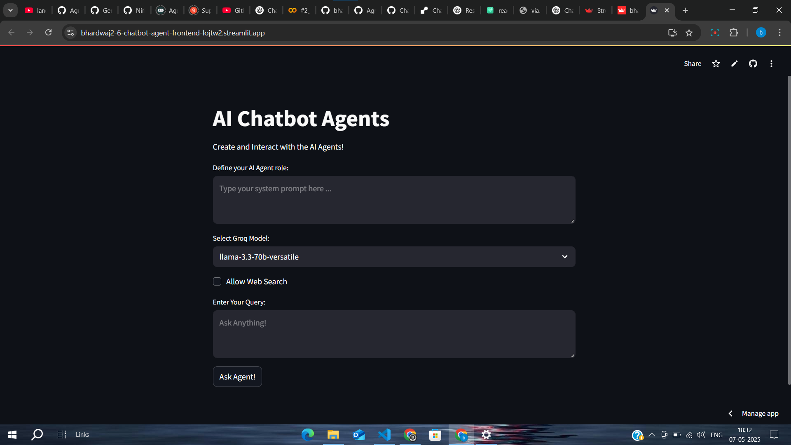

# 🤖 Chatbot_Agent

A modular, Python-based chatbot framework designed for seamless integration of AI-driven conversational agents with backend logic and frontend interfaces.

🚀 Live Demo: https://bhardwaj2-6-chatbot-agent-frontend-lojtw2.streamlit.app/

# 🧩 About the Project


Chatbot_Agent is a learning project that explores various aspects of generative AI through a LangChain-based chatbot. It uses a Streamlit web interface (frontend) to interact with large language models (LLMs) hosted on Groq’s API. The project demonstrates integration of multiple open-source LLMs – including Meta’s Llama-3.3-70B-Versatile and Llama-3.1-8B-Instant, and Google’s Gemma2-9B-It – via Groq’s fast inference API
. LangChain is used to orchestrate the prompt chains and model management, enabling the chatbot to generate human-like responses
. The backend runs in the cloud on Render, a modern platform for deploying and scaling web services
. Together, these components create an interactive AI agent where users can enter questions in natural language and receive answers generated by the selected model.

#  🎯 Motivation and Problem Solved


I built this project to gain hands-on experience with generative AI tools and understand how to orchestrate AI applications end-to-end. By combining LangChain, open-source LLMs, and a cloud deployment, the project addresses real challenges in AI app development: integrating multiple models, handling model selection logic, and providing a smooth user interface. It solves the problem of experimenting with different LLMs without needing complex local setups or expensive subscriptions – Groq’s API makes open models easy to access, and LangChain makes it easier to switch models and manage prompts. In short, the project serves as a sandbox to learn how frontends, backends, and AI models work together to power an intelligent chatbot.
# ✨ Features


- **Dynamic Model Selection:** Users can switch between multiple LLMs at runtime. The app integrates models like Meta’s Llama and Google’s Gemma, demonstrating multi-model interaction.


- **Language Understanding:** Leveraging LLMs via LangChain, the bot can interpret queries and generate coherent, human-like responses in natural language.

- **Streamlined Conversation Flow:** The system uses prompt chains (via LangChain) to maintain context and refine answers, showcasing how generative models can handle follow-up questions seamlessly.

- **User-Friendly Interface:** A clean Streamlit UI presents a simple chat layout. Users type questions and see answers in real-time, with model outputs and sources clearly displayed. The interface requires no frontend coding knowledge to build and is intuitive to use.


# 🛠️ Tech Stack


- **Python:** A high-level, general-purpose language known for readability and rich libraries. All backend logic, model calls, and the Streamlit app are implemented in Python for rapid development.
- **LangChain:** An open-source framework for building LLM applications. It provides abstractions for prompt templates and chains, allowing easy orchestration of multiple LLMs and tools. LangChain was chosen to simplify prompt engineering and model switching.
- **Streamlit:** An open-source Python framework for creating data apps quickly. Streamlit enables turning Python scripts into interactive web apps without frontend code. It is used here to build the chatbot UI in just a few lines.
- **Groq API:** A hardware-accelerated inference API for fast LLM access. GroqCloud hosts open models (Llama, Gemma2, etc.) and delivers low-latency responses. The project uses the Groq Python SDK to call these models. Groq was chosen for its support of cutting-edge open models and fast performance.
- **Render:** A cloud application platform for deployment. Render provides one-click deployment of web services and automatic scaling. The backend (Python app) is hosted on Render to keep the service online and up-to-date with each code push.
# 🧱 Code Structure
bash
Copy
Edit
```
Chatbot_Agent/
├── ai_agent.py        # AI agent implementation
├── backend.py         # Backend logic and API endpoints
├── frontend.py        # Frontend interface
├── requirements.txt   # Python dependencies
├── Procfile           # Deployment configuration
├── .gitignore         # Git ignore file
└── __pycache__/       # Compiled Python files


```
# ⚙️ Installation
 

1. **Clone the repository:**

```bash 
git clone https://github.com/bhardwaj2-6/Chatbot_Agent.git
cd Chatbot_Agent
```
2. **Create a virtual environment:**

``` bash
python -m venv venv
source venv/bin/activate  # On Windows: venv\Scripts\activate
```
3. **Install dependencies:**

``` bash
pip install -r requirements.txt
```
4. **Set environment variables:** You need a Groq API key (get a free key from groq.com). Then set it in your shell:
```bash
export GROQ_API_KEY="your-groq-api-key"
```
(On Windows use set GROQ_API_KEY=your-groq-api-key.) Ensure the key is set before running the app.

5. **Run the app:**
``` bash
streamlit run main.py
```
This will start the Streamlit server and open the chatbot in your browser (typically at http://localhost:8501).


# 🔧 Usage





Once running, the Streamlit UI shows a chat window. On the sidebar (or top), you can select an LLM model (e.g. Llama-3.3-70B, Llama-3.1-8B, or Gemma2-9B-It). In the main panel, type a question into the input box and press Enter or click “Send”. The app sends the query to the chosen model via Groq’s API and displays the response in the chat history. For example, in the placeholder above, the user asks “What is this document about?” and the bot summarizes the contents. You can continue the conversation by asking follow-up questions; LangChain maintains context so the model’s replies stay relevant. The interface also shows any reference sources or citations if the model outputs them.


# 🤝  Contributing


Contributions are welcome! To contribute, please fork the repository and submit a pull request. Make sure your changes are well-documented and follow the existing code style. You can open issues for bug reports or feature requests. Because this is an educational project, testing and code reviews help keep it stable. If you build new functionality (e.g. support for additional LLMs or features), please update the README and, if appropriate, include simple examples.
